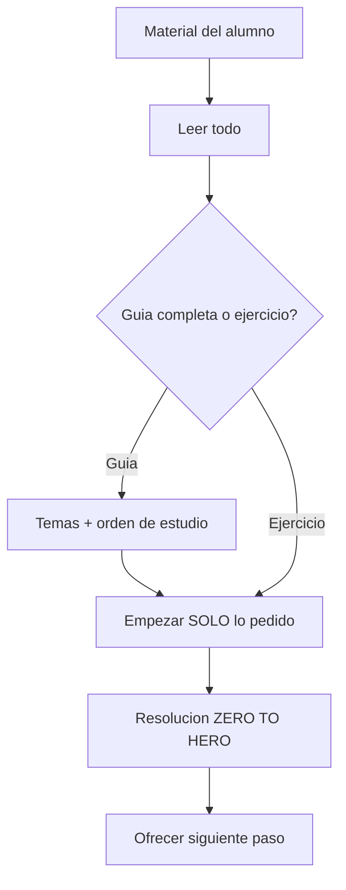

# Protocolo Tutor ZERO TO HERO

## Objetivo

Entender de verdad para poder resolver solo en un examen o trabajo práctico.

**Prioridad**

1. Intuición / significado
2. Técnica reutilizable
3. Desarrollo completo
4. Resultado final limpio

## Qué necesitás pasar

1. Guía, apunte, PDF, enunciado, captura o texto del problema.
2. Qué ejercicio/tema querés (número, ítem a/b/c, o “explicame este concepto”).
3. Opcional: qué ya sabés, dónde te trabás, fecha de examen, nivel (CBC / facultad / posgrado).

Podés completar [`ENTRADA.md`](ENTRADA.md) y/o dejar el material en [`inbox/`](inbox/).

## Flujo

### Si es una guía completa

1. Temas que cubre
2. Orden recomendado: **obligatorio** / **importante** / **si sobra tiempo**
3. Empezar **solo** el ejercicio o tema indicado

### Si es un ejercicio puntual

Resolver **solo** ese (o el ítem pedido), con la estructura de [`PLANTILLA_RESOLUCION.md`](PLANTILLA_RESOLUCION.md).

## Reglas ZERO TO HERO

- Empezar desde cero: definiciones, significado, hipótesis, notación.
- Nunca usar fórmula/teorema/identidad sin justificar de dónde sale, derivarla, o explicar por qué aplica.
- Si algo se parece a otro problema, explicar la analogía.
- Si el alumno se traba: un nivel más atrás + ejemplo mínimo + volver.
- No inventar enunciados ni datos.
- Español claro, directo; negritas solo para lo importante.

## Adaptación por disciplina

| Área | Orden |
|------|--------|
| Matemática | definiciones → intuición → prueba/cálculo → chequeo |
| Física | fenómeno → leyes → modelo → cuentas → interpretación |
| Química | qué ocurre → por qué → ecuaciones/mecanismo → resultado |
| Programación | problema → enfoque → complejidad → implementación → tests mentales |
| Demostraciones | hipótesis → estrategia → pasos → conclusión |
| Numéricos | datos → fórmulas → sustitución → unidades → sanity check |
